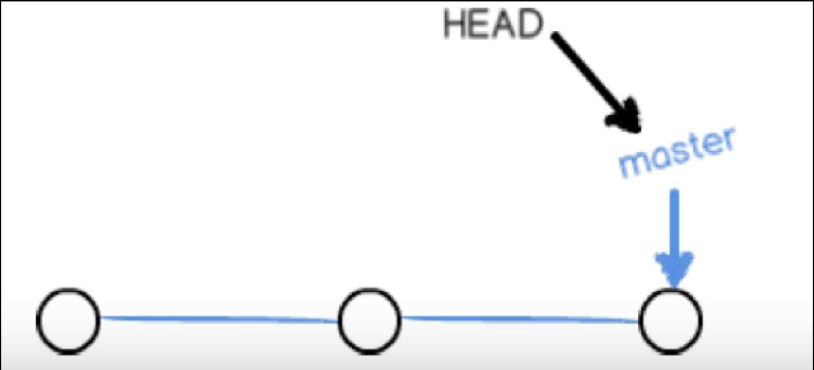
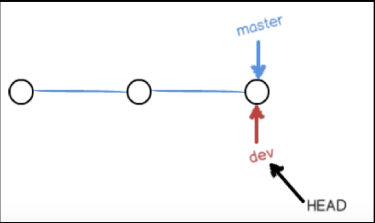
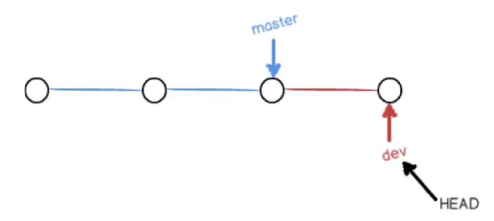
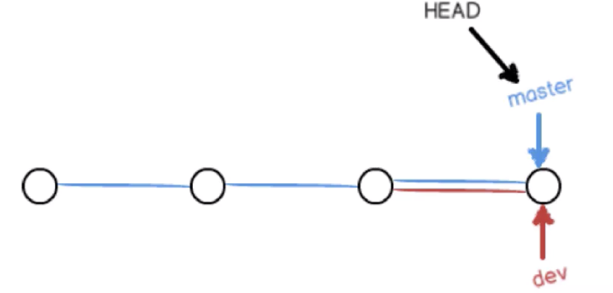
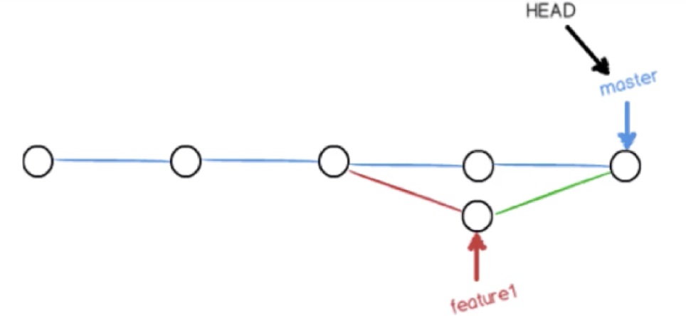

# HEAD和分支的关系
* HEAD指向的是当前分支
* 分支名称指向的是当前最新的一次提交

默认master分支

从master分支创建出一个新的dev分支

在dev分支上进行了一次新的commit

将dev分支merge到master分支

master分支做了一次commit，feature分支也做了一次commit，然后将feature分支merge进master分支时，很可能会出现冲突。
此时在master分支上手动解决冲突后，再add，再commit，然后再将feature分支merge进master，就会快进（Fast Forward）合并

